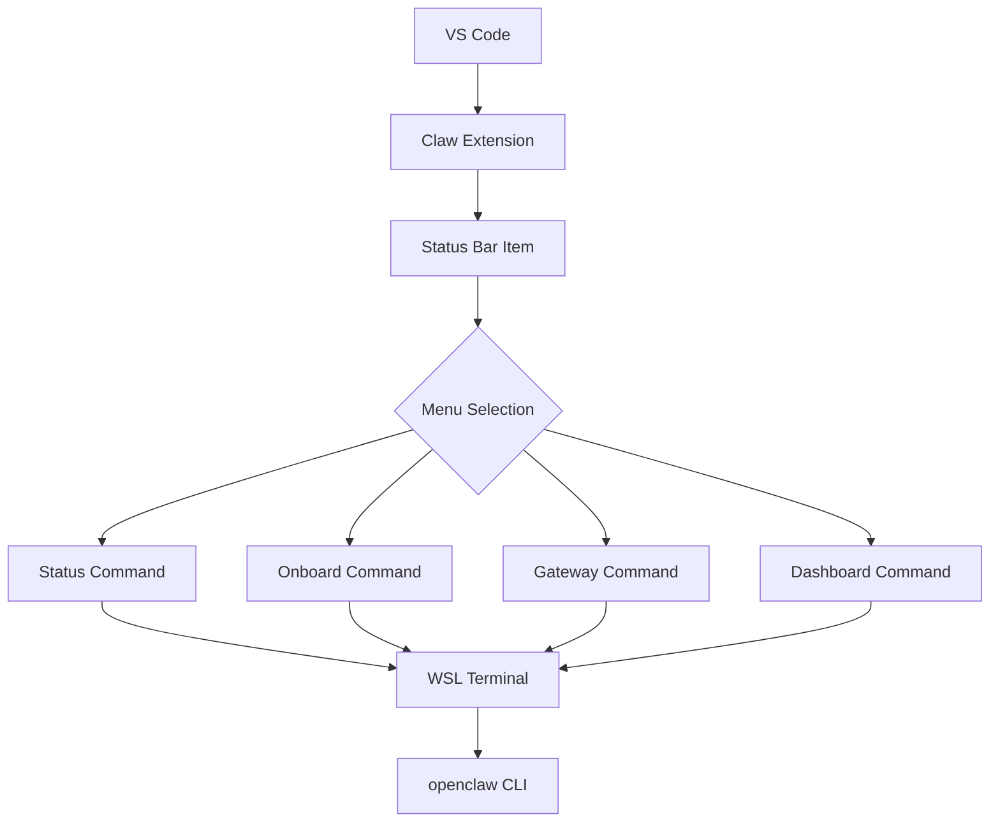

# magnet 🧲⚡

A simple extension that manages Claw connection via a status bar magnet.


## Prerequisites

- Visual Studio Code version 1.74.0 or higher (if you are using vscode fork, check it under Help > About)
- [openclaw](https://www.npmjs.com/package/openclaw) installed; if not, install it via npm:

```bash
npm install -g openclaw
```

- [gguf-connector](https://pypi.org/project/gguf-connector/) installed; if not, install it via pip/pip3:

```bash
pip install gguf-connector
```

*if you don't use the Terminal button then gguf-connector is optional


## Features

- **Menu Selection Scheme**: Re-structured to provide command menu with options:
  - Dashboard
  - Checker (checks openclaw package status; this will help and walk you through: install/upgrade it to the latest version)
  - Setup
    - Onboard
    - Pair up
      - no headache and simplify the pairing process
  - Gateway
    - Run
    - Status
    - Start
    - Stop
    - Restart
  - Terminal (gguf-connector needed)

- **OS Detection**: Automatically detects operating system:
  - Uses WSL terminal on Windows (please study [wsl](https://learn.microsoft.com/en-us/windows/wsl/install) first if you don't have it as openclaw doesn't work well in powershell and git bash recently)
  - Uses native terminal on other platforms

- **Auto-Connect**: Optional setting to automatically connect on startup (disabled by default)

- **Terminal Management**: Creates or reuses terminal based on OS detection
- **Command Execution**: Supports multiple commands (dashboard, onboard, gateway, etc.)


## Usage

1. Click the 🧲Claw status bar item (bottom right) to show the menu
2. Select one of the options from the menu (Dashboard, Checker, Setup, Gateway, Terminal)
3. The extension will open a terminal and execute the corresponding `claw` command
4. To enable auto-connect, go to Settings and enable `Claw: Auto Connect`

## Configuration

- `claw.autoConnect`: Boolean value to automatically connect to Claw on startup (default: false)

## Structure Diagram




*fetch the weather info in SF today; write a color picker for picking a random color for background

## Workflow

```
openclaw (standard procedure)
├──Initialization: Extension activates and creates status bar item
├──User Interaction: User clicks status bar item to open menu
├──Command Selection: Dashboard, Checker, Onboard, Gateway, or Terminal
├──Terminal Management: Extension creates or reuses terminal based on OS
└──Command Execution: Selected command is sent to terminal
```


*make a flappy bird game on the air

## Development

1. Install dependencies: `npm install`
2. Compile: `npm run compile`
3. Press F5 to launch the Extension Development Host


*create a star war game on the go

## Commands

- `Claw: Show Menu` - Show the Claw menu with command options


*code a tic tac toe game (allows two players or playing against an AI)

## License
MIT

